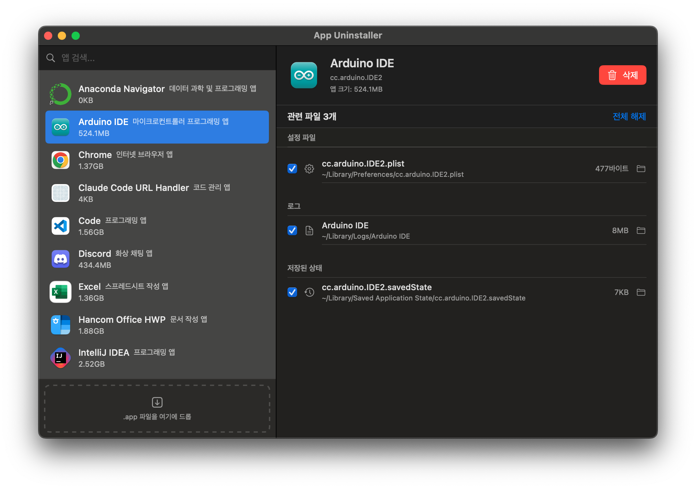

# 🧹 App Uninstaller

> macOS 앱과 관련 잔여 파일을 깔끔하게 삭제하는 네이티브 유틸리티 앱

---

## ✨ 주요 기능

| 아이콘 | 기능 | 설명 |
|:---:|------|------|
| 🔍 | **앱 스캔 & 관련 파일 탐색** | 설치된 앱을 자동 탐지하고, Bundle ID 기반으로 잔여 파일(캐시, 설정, 로그 등)을 찾아냅니다. |
| 🗑️ | **선택적 삭제** | 파일별 체크박스로 삭제 대상을 고르고, 휴지통으로 안전하게 이동합니다. |
| 🤖 | **AI 앱 설명** | Groq API로 각 앱의 한국어 설명을 자동 생성하고 캐싱합니다. |
| 📥 | **드래그 앤 드롭** | `.app` 파일을 창에 드롭하면 바로 삭제 플로우가 시작됩니다. |

---

## 📸 스크린샷



---

## 📋 요구 사항

- **macOS** 13.0 (Ventura) 이상
- **Xcode** 15.0 이상
- **Groq API Key** (선택사항 — AI 앱 설명 기능 사용 시 `Secrets.plist`에 `GROQ_API_KEY` 등록 필요)

---

## 🚀 빌드 및 실행 방법

```bash
# 1. 저장소 클론
git clone https://github.com/<your-username>/appUninstaller.git
cd appUninstaller

# 2. Xcode에서 열기
open AppUninstaller.xcodeproj

# 3. 또는 CLI로 빌드
xcodebuild -project AppUninstaller.xcodeproj -scheme AppUninstaller -configuration Debug build
```

### Groq API 설정 (선택)

AI 앱 설명 기능을 사용하려면 `AppUninstaller/Secrets.plist` 파일에 API 키를 추가하세요:

```xml
<dict>
    <key>GROQ_API_KEY</key>
    <string>YOUR_GROQ_API_KEY</string>
</dict>
```

---

## 🛠️ 기술 스택

| 분류 | 기술 |
|------|------|
| 언어 | Swift 5 |
| UI 프레임워크 | SwiftUI |
| macOS API | `FileManager`, `NSWorkspace`, `NSAppleScript` |
| 파일 검색 | `mdfind` (Spotlight), Bundle ID 기반 탐색 |
| AI 연동 | Groq API (LLaMA 3.3 70B Versatile) |
| 캐싱 | CSV 파일 기반 로컬 캐시 |
| 아키텍처 | MVVM (Model-View-ViewModel) |

---

## 📁 프로젝트 구조

```
AppUninstaller/
├── AppUninstallerApp.swift          # 앱 진입점 (@main)
├── AppUninstaller.entitlements      # 앱 권한 설정
├── Info.plist                       # 앱 메타데이터
├── Secrets.plist                    # Groq API 키 (gitignore 권장)
├── Assets.xcassets/                 # 앱 아이콘 및 에셋
├── Models/
│   ├── AppInfo.swift                # 앱 정보 모델 (이름, Bundle ID, 크기, AI 설명)
│   └── RelatedFile.swift            # 관련 파일 모델 + 9개 카테고리 분류
├── Views/
│   ├── ContentView.swift            # 메인 레이아웃 (HSplitView 좌우 분할 + 드래그 앤 드롭)
│   ├── AppListView.swift            # 앱 목록 + 검색 바 + 드롭존
│   └── DetailView.swift             # 앱 상세 헤더 + 파일 목록 + 삭제 확인 시트
└── Services/
    ├── AppScanner.swift             # /Applications 스캔 + 디렉토리 크기 계산
    ├── FileSearcher.swift           # Bundle ID 기반 관련 파일 탐색 + Spotlight 검색
    ├── AppManager.swift             # 상태 관리 ViewModel (스캔, 삭제, 권한 체크)
    └── AppDescriptionFetcher.swift  # Groq API 앱 설명 생성 + CSV 캐시 관리
```

